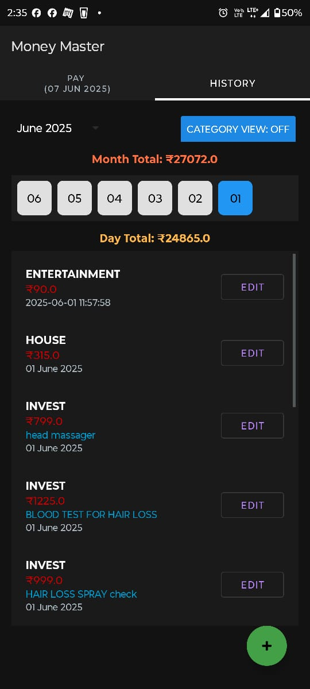
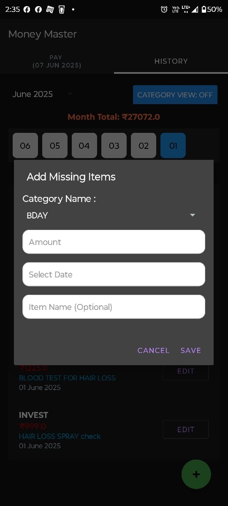
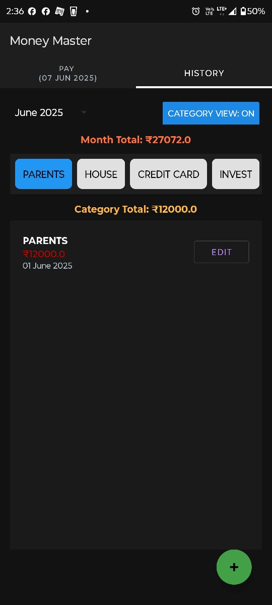
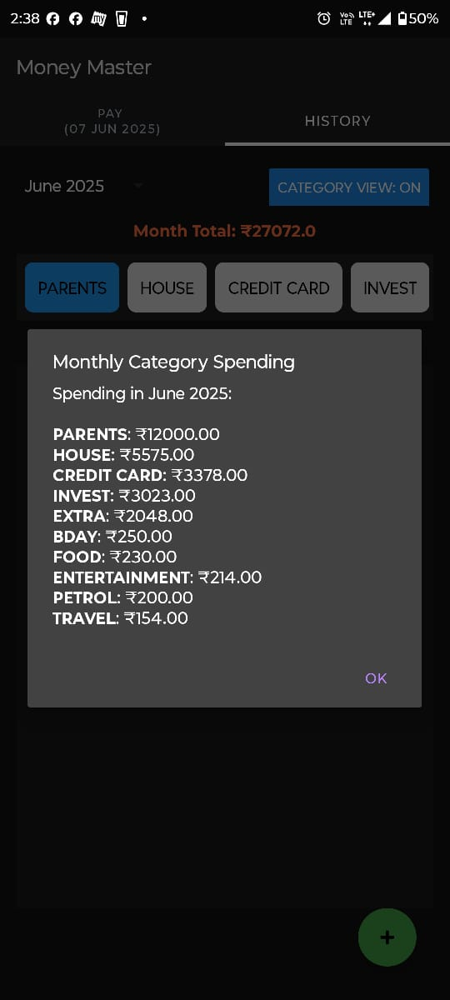

# Money Master - Expense Tracker Android App

A comprehensive budget and expense tracking Android application built with Java and Room Database. This app helps users manage their finances locally by tracking expenses across different categories with real-time budget monitoring and detailed spending history — all stored offline-first using Room.
## Features

### 📊 Budget Management
- **Category-based budgeting**: Create and manage expense categories with individual budgets
- **Real-time balance tracking**: Monitor remaining budget balances for each category
- **Budget reset functionality**: Reset all category budgets to their original amounts
- **Balance adjustments**: Automatic budget balance updates when expenses are recorded

### 💰 Expense Tracking
- **Quick payment processing**: Record expenses against specific categories
- **Pay Button**: The Pay button redirects to any supported payment app (e.g., GPay, CRED, PhonePe).
- **Automatic balance deduction**: Budget balances update automatically when payments are made
- **Payment validation**: Prevents invalid transactions and provides error feedback
- **Multi-currency support**: Handle decimal amounts with precision

### 📈 History & Analytics
- **Monthly expense reports**: View spending organized by month and year
- **Daily spending breakdown**: Detailed view of expenses by specific dates
- **Category-wise analysis**: Track spending patterns across different categories
- **Total spending calculations**: Automatic calculation of daily, monthly, and category totals
- **Historical data management**: Edit, update, or delete past expense entries

### 💾 Local Data Management
- **Offline support**: Works fully offline using Room database
- **Data persistence**: All data is stored on the device with SQLite/Room
- **Live update**: Cloud-based data storage ensures data safety
- **Thread-safe operation**: All DB queries run on background threads

## 📸 Screenshots

<p align="center">
  
   
  
  
   
  
  
</p>


## Tech Stack

- **Language**: Java
- **Database**:  Room (Android Jetpack)
- **Platform**: Android
- **Architecture**: Model-View-Controller (MVC) pattern
- **Threading**: Background threading with Executor, Thread, and LiveData


## Getting Started

### Prerequisites

- Android Studio (latest version recommended)
- Android SDK (API level 21 or higher)
- 

### Installation & Setup

1. **Clone the repository**
   ```bash
   https://github.com/AstinOfficial/MoneyMaster.git
   cd MoneyMaster
   ```

2. **Open in Android Studio**
   - Launch Android Studio
   - Select "Open an existing Android Studio project"
   - Navigate to the cloned repository folder and select it

3. **Build the Project**
   - Let Gradle sync and resolve all dependencies
   - Run the app on emulator or device

### Configuration

1. **No Cloud Database Required**
   - No network connection required
   - All data stays on-device

2. **Customize App Settings**
   - Run the app on an emulator or device
   - Change categories, budget values, and default configurations in RoomHelper.java

## Usage

### Setting Up Categories
1. Create expense categories (e.g., Food, Transportation, Entertainment)
2. Set budget amounts for each category
3. Monitor remaining balances

### Recording Expenses
1. Select a category
2. Enter the expense amount
3. Add optional item description
4. Click the Pay Button to redirects to any supported payment app (e.g., GPay, CRED, PhonePe).

### Viewing History
1. Navigate to History section
2. Browse by month/year
3. View detailed breakdowns by day or category
4. Edit or delete entries as needed

### Managing Budgets
1. Reset all budgets to original amounts
2. Adjust individual category budgets
3. Monitor spending against budgets


## 📌 Note for Developers

 **This app is designed for personal finance tracking. Always ensure your financial data is secure and backed up appropriately.**

## Contributing

1. Fork the repository
2. Create a feature branch (`git checkout -b feature/new-feature`)
3. Commit your changes (`git commit -am 'Add new feature'`)
4. Push to the branch (`git push origin feature/new-feature`)
5. Create a Pull Request


## 🙋‍♂️ Author
Astin Biju <br>
Feel free to connect on <a href="https://www.linkedin.com/in/astin-biju/">LinkedIn</a> or message me for questions or collaboration.

